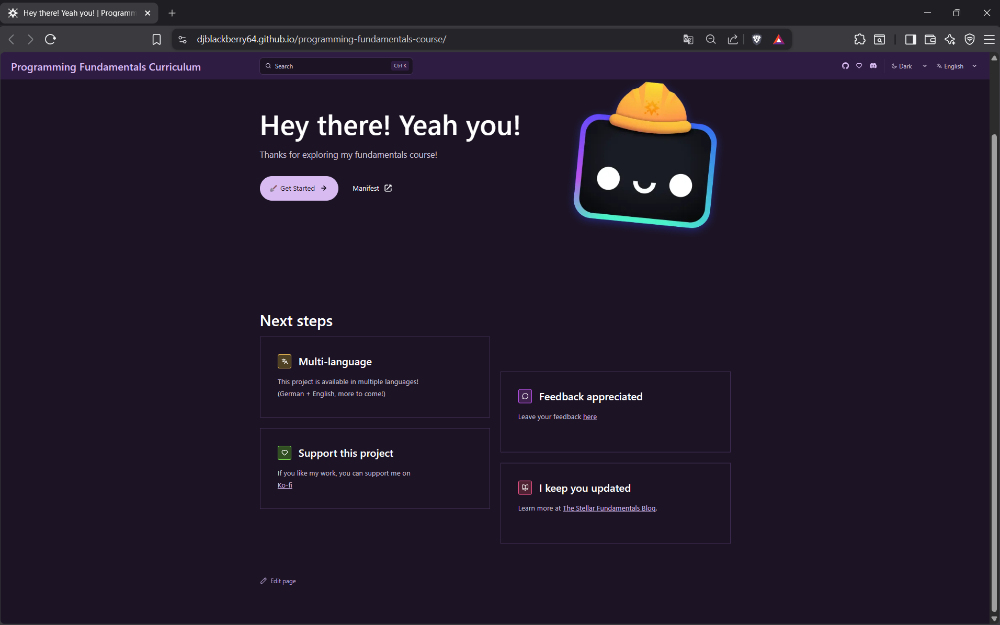

# Programming Fundamentals Curriculum

## Welcome to my curriculum!

I sincerely appreciate that you're here and want to build some solid fundamentals in software development. Don't worry there will be additional resources at the end so that you can continue with that momentum!

## What you should know beforehand

This is a curriculum that uses:

- storytelling and metaphors as its main teaching methods
- walks you through the topics one by one to ensure understanding builds up over time

If you're looking for a dry reference you're at the wrong place.

## Why or how is this useful for you?

This curriculum aims at building solid fundamentals before you even touch the code. 
It explains core concepts and uses different programming languages as examples of how these fundamentals get executed in different programming languages e.g. Statically vs. Dynamically typed languages.

This course uses self-shot photography, a storyline as well as simple language to make the learning experience more pleasant for y'all.

Here is the link to the site: <a href="https://djblackberry64.github.io/programming-fundamentals-course/">Hosted curriculum online</a>

## "Why another free course online?"

Initially, the goal of this project was to build myself a custom-reference. Something where I can look up the very basics I sometimes forget when things get busy.

The intention was to make it more pleasant to come back than a dry tutorial which is why you'll see all these self-shot pictures and the storytelling aspects in this project.

My thought was "Why not... put this out there? If even one person finds this helpful, this will pay off. And hey, you might learn something in the process."

Safe to say, I did learn something while building this project.
From...

- The first draft
- Customization
- Config hell
- And now this migration

I didn't give up. Because the goal is still the same
**"Make something that you would have wanted to exist while you were learning to program"**

It played out you know? I heard from a friend that recommended this, that a person started a computer science degree. She had the spark. I just provided her with some fuel.

I think everyone has that spark... they just might not have the fuel yet.

## How to self-host this project

- Fork this repo
- run `npm install` to install all dependencies
- change the `site` attribute to your url in `astro.config.mjs`
- change the `base` attribute to your subdirectory/repo name in `astro.config.mjs`
- Host the project at your provider of choice by following the deployment documentation of Astro [found here](https://docs.astro.build/en/guides/deploy/)

### 👀 Still got questions?

Check out [Starlight’s docs](https://starlight.astro.build/), read [the Astro documentation](https://docs.astro.build), or jump into the [Astro Discord server](https://astro.build/chat).

## A quick look at the project

## "I wanna use the assets in this curriculum for commercial purposes"

Hey I don't mind you using the assets for your non-commercial projects. 

However, if you wanna use them commercially visit [Ko-fi](https://ko-fi.com/djblackberry64) for a commercial license. 

Take care and good luck with your projects!

## Achievements

### MkDocs

- This project was extended during Hack Club's Flavortown (Spring 2026) and earned me an ESP32 Kit and exclusive community merch.

### Astro Starlight

- This project was functionally ported to Astro Starlight during Hack Club's Stardance (End of July 2026).
