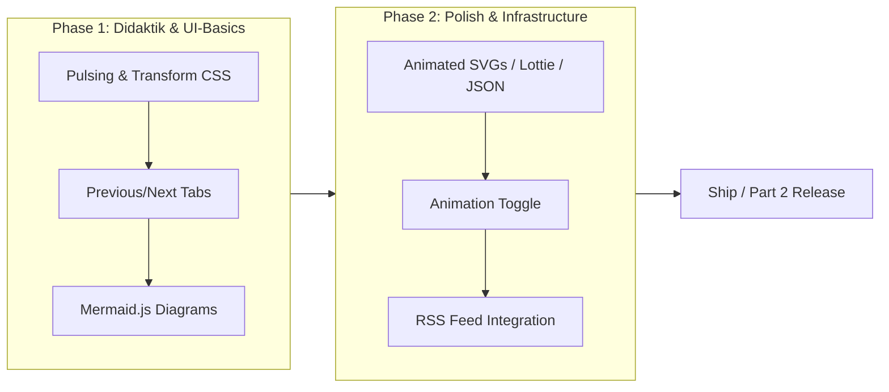

```mermaid
flowchart LR

subgraph Phase1["Phase 1: Didaktik & UI-Basics"]
A --> B --> C
A[Pulsing & Transform CSS]
B[Previous/Next Tabs]
C[Mermaid.js Diagrams]
end

subgraph Phase2["Phase 2: Polish & Infrastructure"]
D[Animated SVGs / Lottie / JSON] --> E[Animation Toggle]
E --> F[RSS Feed Integration]
end

    Phase1 --> Phase2 --> G[Ship / Part 2 Release]

```
