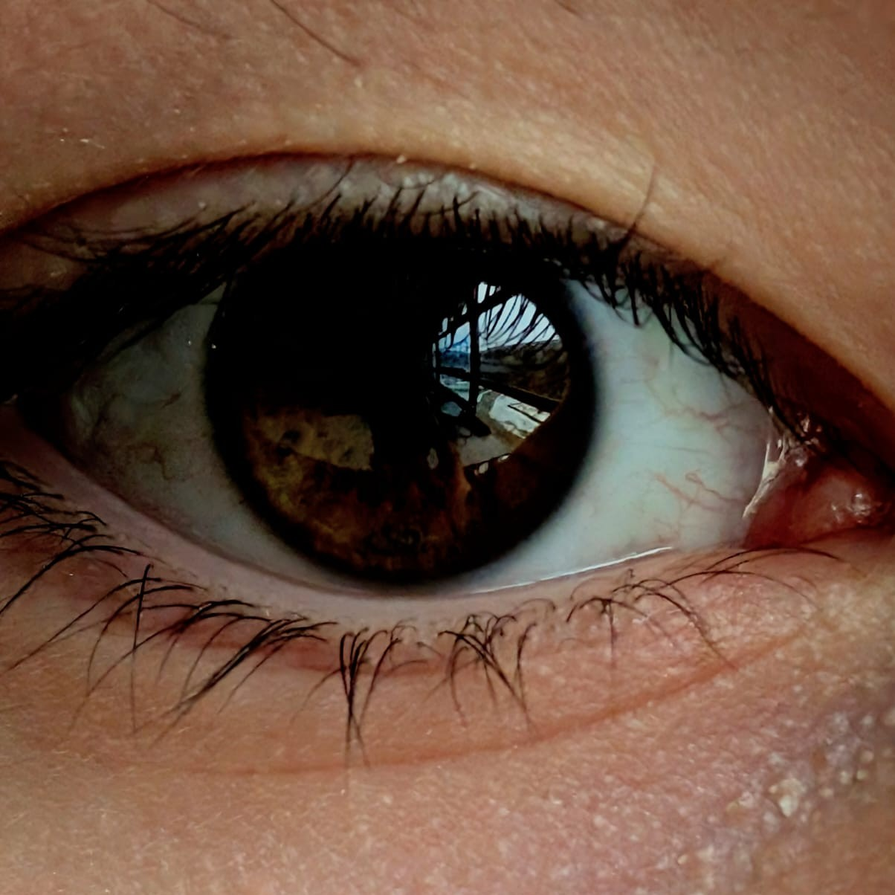

# Welcome to this curriculum

_This curriculum teaches programming fundamentals that apply no matter which language you choose.
It’s designed to help you navigate the tough moments that often stop people before they even get started._

## Curriculum Overview

You'll see the overall progression of the curriculum here.
Please be sure to check for updates as this curriculum is in active development.

<figure>

<figcaption id="text">Click to start your journey</figcaption>

</figure>

## Support

If you wanna support me, consider buying me a coffee on Ko-fi at <a href="https://ko-fi.com/djblackberry64">Link to site</a>  or just click the button down below to get redirected: 

## Used Program

For full documentation visit [Starlight](https://starlight.astro.build/) as this was the static site generator used in this project.
